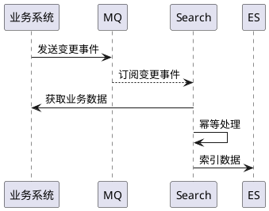
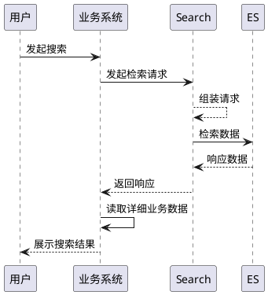
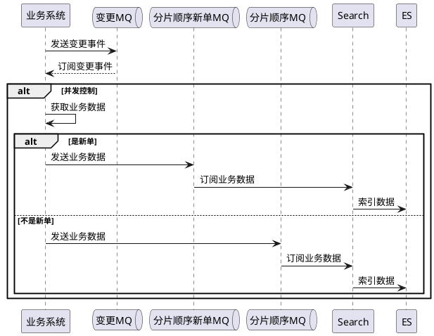

title: 记一次业务系统与ES的同步方案升级
tags: []
categories: []
date: 2023-08-28 15:05:47
---
# 背景

目前ES中接入了诸多业务线，其技术方案一直延续第一版，由ES处理获取数据和搜索的业务逻辑。随着时间的发展，在**并发场景下发现了数据不一致，数据被重复覆盖的问题**。而且从架构上，search引入业务系统的API也不是合理的架构。

# 现状

**写入链路如下**

**读取链路如下**

因为MQ的发送后的消费并不能保证强一致，可能会导致乱序执行。至于不用分片顺序，因为MQ中会有批量，导致无法区分分片信息。search同时还需要作幂等，限流等，导致Search服务更重。

# 目标

暂时的目标如下：

1.  减轻Search的循环依赖的问题，Search不再依赖业务系统。
2. 减轻Search服务的业务逻辑
3. 解决并发下的数据不一致问题

# 技术方案

本次改造只涉及写入流程，不会涉及读取流程

## 主要优化

* 全流程新单链路独立，优化新单的可搜索延迟
* Search去除业务系统依赖，由业务系统自发自接数据，处理后统一发送到Search。

## 时序图

## 新单的延迟优化

在一般业务场景中，新单的延迟比单子的搜索不准确感知更明显。针对新单的我们需要做一些特殊优化，使延迟降低到无感的地步。

**建议**

新建单操作与更新操作隔离，新建单使用单独的topic

## 并发下数据一致性

在无法保证单次操作时，仅发送一次变更事件的情况下，使用分布式锁保证数据一致性，是相对来说比较好的方案。

**建议**

使用分布式锁，对订单上锁，加锁范围 见 时序图的【并发控制】

**缓解ES的写入压力**

很多时候，更新可能只是触发一次保存操作，实际上数据没有变化的，业务系统中可以做一层对比层，数据有变化再发送到Search。由此缓解ES的写入压力。其次与单次操作无法保证仅发送一次变更事件一样，多次变更是无效的。

**建议**

内部使用DB或者Redis，建立一层针对单号的对比逻辑，与上次发送的数据如果一致，则不发送。

该对比逻辑需要有开关控制，使用快捷的手段【acm，db配置等】一分钟内可操作开启关闭

## 数据传输优化

在系统中以拖车40HC*30箱为例【WY268171】，履约系统的业务数据转换成JSON后有27万字符，270KB。这种场景下对MQ的压力会相对较大，对于大JSON是否需要空间换时间，值得考虑。

**从空间角度来说**

以该JSON为例，如使用gzip压缩，大小可以压缩到12KB，4%的压缩率，即压缩后节约96%的空间。但是代价是什么呢？

**从时间角度来说**

该字符串压缩100次 632毫秒，每次压缩6毫秒解压100次 361毫秒，每次解压3.6毫秒

**结论**

由此可见，对于大于1万个字符的字符串，以空间换时间，比较划算

压缩相关由Search提供工具包

1.  压缩工具类
2. 压缩枚举
3. Message的数据处理

# Message定义

|字段|类型|备注|
| ------------| --------------------| ----------------------------|
|indexName|String|索引类型，由Search提供常量|
|indexId|String|索引下唯一的ID|
|systemName|String|系统名称，系统随便定义|
|timestamp|long|时间戳|
|compress·|String|压缩类型，枚举【todo】|
|dataJson|String|明文数据【未压缩下的数据】|
|dataByte|byte[]|字节数组【压缩后的数据】|
|paramExt|Map<String,String>|附属信息|

# 结果

// todo